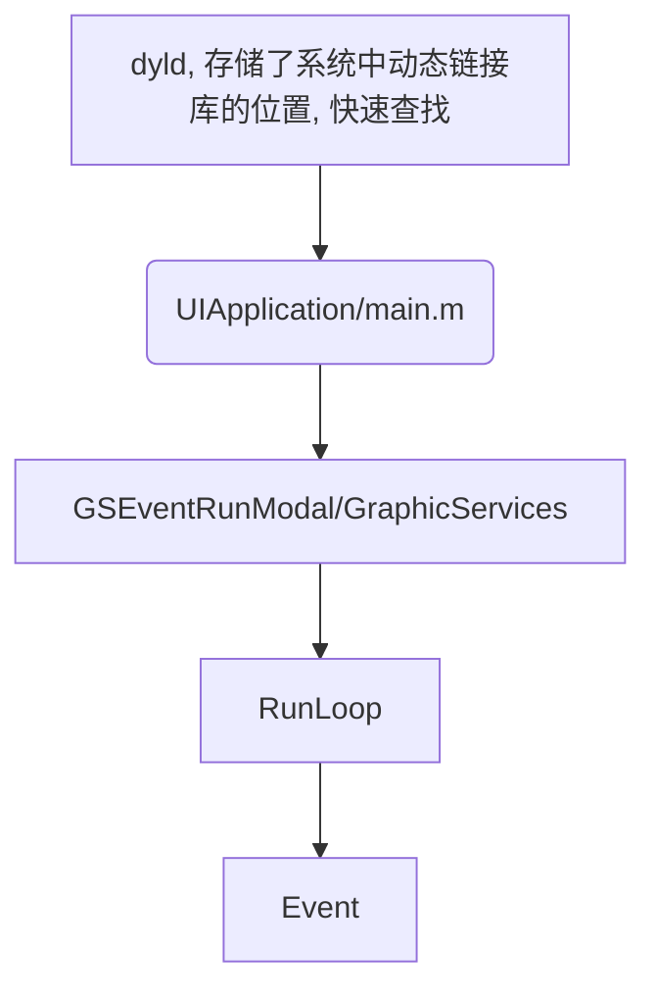

### 展示线程调用栈

---

首先看一下函数调用栈, 该图来自于 [Wiki](https://en.wikipedia.org/wiki/Call_stack)


上图表示了一个栈，它分为若干栈帧(frame)，每个栈帧对应一个函数调用，比如蓝色的部分是 `DrawSquare` 函数的栈帧，它在执行的过程中调用了 `DrawLine` 函数，栈帧用绿色表示。

可以看到栈帧由三部分组成: 函数参数，返回地址，帧内的变量。举个例子，在调用 `DrawLine` 函数时首先把函数的参数入栈，这是第一部分；随后将返回地址入栈，这表示当前函数执行完后回到哪里继续执行；在函数内部定义的变量则属于第三部分。

`Stack Pointer(栈指针)`表示当前栈的顶部，由于大部分操作系统的栈向下生长，它其实是栈地址的最小值。根据之前的解释，`Frame Pointer` 指向的地址中，存储了上一次 `Stack Pointer` 的值，也就是返回地址。

在大多数操作系统中，每个栈帧还保存了上一个栈帧的 `Frame Pointer`，因此只要知道当前栈帧的 `Stack Pointer` 和 `Frame Pointer`，就能知道上一个栈帧的 `Stack Pointer` 和 `Frame Pointer`，从而递归的获取栈底的帧。

显然当一个函数调用结束时，它的栈帧就不存在了。

因此，调用栈其实是栈的一种抽象概念，它表示了方法之间的调用关系，一般来说从栈中可以解析出调用栈。

#### 思路

刚看到这个需求的时候, 想起来 `iOS` 中`Thread.callstackSymbols`可以获取到调用堆栈信息, 但是实施的时候发现不行, 有两个原因:

1. 的确可以获取到堆栈信息, 但是没法得到预估时间.


2. 我们程序启动之后, 就会开启一个RunLoop(一个循环, 类似于如下代码), 我们UI刷新, CADisplayLink，CATransition，CAAnimation, GCD中的Main Queue也会放入主循环中. 其他线程, 以及其他事件会添加到其他的 runloop 中, 每一个线程都维护了自己的runloop, runloop 的调用顺序是source0、source1、timer、dispatch_queue, UI 相关都会放入source0(____CFRunLoopDoSources0__)中, 在一步步执行到Viewdidload()方法, 事件处理完毕之后陷入休眠, 等待事件唤醒, 这时候如果在子线程想打印主线程的信息就无法抓取到了, 因为已经执行完其他方法(都已经出栈了). `performSelector`也是发送了一个消息(事件), runloop 在执行. 所以不可行

```C
int main(int argc, char * argv[]) {
     //程序一直运行状态
     while (AppIsRunning) {
          //睡眠状态，等待唤醒事件
          id whoWakesMe = SleepForWakingUp();
          //得到唤醒事件
          id event = GetEvent(whoWakesMe);
          //开始处理事件
          HandleEvent(event);
     }
     return 0;
}
```

主线程的栈信息:



`RunLoop/包含CFRunLoopRunSpecific，__CFRunLoopRun，__CFRunLoopDoSouces0，CFRUNLOOP_IS_CALLING_OUT_TO_A_SOURCE0_PERFORM_FUNCTION`


#### 实现思路

既然直接使用自带的`Thread.callstackSymbols`方法, 那么就需要另辟蹊径了, 回想一下我们开始看到的线程的调用栈, 我们每一个当前还未出栈的方法还未执行, 都是保存在栈里面的, 我们可以通过获取栈帧然后递归到栈底.

所以我们现在需要去拿到栈的指针(StackPointer)以及栈帧指针(FramePointer).

```
系统提供了 task_threads 方法，可以获取到所有的线程，注意这里的线程是最底层的 mach 线程.

对于每一个线程，可以用 thread_get_state 方法获取它的所有信息，信息填充在 _STRUCT_MCONTEXT 类型的参数中(这个方法中有两个参数随着 CPU 架构的不同而改变).

我们需要存储线程的StackPointer以及 顶部的FramePointer, 通过递归获取到整个调用栈.

根据栈帧的 Frame Pointer 获取到这个函数调用的符号名
```

这样我们的实现思路就是:

1. 获取线程的StackPointer 以及 FramePointer
2. 找到FramePointer属于哪一个镜像文件(.m)
3. 获取镜像文件的符号表
4. 在符号表中找到函数调用地址对应的符号名
5. return 到上一级调用函数的FramePointer, 重复第2步.
6. 到达栈底, 退出.

#### NSThread

它是对`pthread`的面向对象表示.

1. `pthread`是(POSIX 的简写，POSIX 表示 “可移植操作系统接口(Portable Operating System Interface)").
2. NSThread的封装方式.

不同的操作会设计自己的线程模型, 所以底层 API 是不相同的, 但是 POSIX提供的pthread就是相当于对底层进行了一次封装, 让不同平台运行得到相同的效果. 

```
Unix 系统提供的 thread_get_state 和 task_threads 等方法，操作的都是内核线程，每个内核线程由 thread_t 类型的 id 来唯一标识，pthread 的唯一标识是 pthread_t 类型。

内核线程和 pthread 的转换(也即是 thread_t 和 pthread_t 互转)很容易，因为 pthread 诞生的目的就是为了抽象内核线程。
```

**我们来看一下NSThread里面用到 pthread 的地方**

```C
- (void) start {
  pthread_attr_t attr;
  pthread_t thr;
  int errno = 0;
  pthread_attr_init(&attr);
  if (pthread_create(&thr, &attr, nsthreadLauncher, self)) {
      // Error Handling
  }
}
```

`NSThread`并没有存储`pthread_t`的信息.

只有在`exit()`方法再次使用了`pthread_exit()`.

我们来研究一下`performSelector`的实现, 它最终会调用

```C++
- (void) performSelector: (SEL)aSelector
                onThread: (NSThread*)aThread
              withObject: (id)anObject
           waitUntilDone: (BOOL)aFlag
                   modes: (NSArray*)anArray;
```

该方法只是一层封装, 用于获取线程`RunLoop`, 真正被调用是在`RunLoop`中的.                 
 
```C++
- (void) performSelector: (SEL)aSelector
          target: (id)target
        argument: (id)argument
           order: (NSUInteger)order
           modes: (NSArray*)modes{
  }
```

封装成`Perfomer`作为一个`Event`放入 `Runloop` 中等待执行.

了解到这里有什么用呢, 我们接着往下看(我们的目标是通过 NSThread 得到 pthread).

系统并没有提供转换的方法, 我们需要寻找其他的方式去实现.

`hook`住`performSelector`的执行, 然后在指定线程的代码部分保存`thread_t`, 执行代码的时机不能太晚, 在打印的调用栈的时候会破坏目前的结构, 最好是在创建的时候就执行, 从上方的代码可以看见`pthread_create(&thr, &attr, nsthreadLauncher, self)` 会执行`nsthreadLauncher`, 该方法的定义:

```C
static void *nsthreadLauncher(void* thread)
{
    NSThread *t = (NSThread*)thread;
    [nc postNotificationName: NSThreadDidStartNotification object:t userInfo: nil];
    [t _setName: [t name]];
    [t main];
    [NSThread exit];
    return NULL;
}
```

惊喜的发现, 它会发送一个一个线程开始`NSThreadDidStartNotification`的通知, 然后监听这个通知去调用`performSelector`方法.

但是`performSelector`是基于runloop的, runloop 需要到main函数才有可能会开启(还有一点, 启动的线程一般在执行完事务之后就会退出销毁, 要做保活, 就需要传入runloop(循环)).

所以, 这个方向也无法解除, 既然无法转换, 那么我们可以找到`NSThread`和`pthread`共有的唯一属性吗?

打印`NSThread`

`<NSThread: 0x600002fc0cc0>{number = 1, name = main}`

有一个地址, 一个线程序号, 线程名称.

地址是堆区的, 线程序号不是很清楚, 最后只剩下名称, 是否名称是唯一的呢? 去尝试一下`pthread_getname_np(pthread_t, UnsafeMutablePointer<Int8>, Int)`方法, 发现对应的名字是一样的(根据bestswifter文中所说, NSThread的setName方法也是直接调用 pthread 接口).

这样我们就可以通过NSThread 通过设置名字接口(记住是唯一的), 然后遍历所有的线程找到名字一样的线程在去获得`StackPointer, FramePointer`等关键信息.

**阅读bestswifter文章的时候, 作者提到了一个坑**

主线程修改名字之后是无法通过`pthread_getname_np`读取到的, 所以我们在之前就将值读取出来.

```Swift
// 获取主线程
let main_thread_t = mach_thread_self()
```

#### 参考文章

[铭神-RunLoop](https://github.com/ming1016/study/wiki/CFRunLoop#%E5%BC%82%E6%AD%A5%E6%B5%8B%E8%AF%95)

[bestswifter-BSBacktraceLogger](https://github.com/bestswifter/BSBacktraceLogger)

[GNUStep-base 的源码](http://www.gnustep.org/resources/downloads.php)
